<a href="https://timwjt.github.io/">
  <picture>
    <source media="(prefers-color-scheme: dark)" srcset="assets/banner-dark.svg">
    
  </picture>
</a>

  <a href="https://timwjt.github.io/">Website</a> &nbsp;·&nbsp;
  <a href="https://www.linkedin.com/in/timwang01/">LinkedIn</a> &nbsp;·&nbsp;
  <a href="mailto:tim200465@gmail.com">Email</a>

